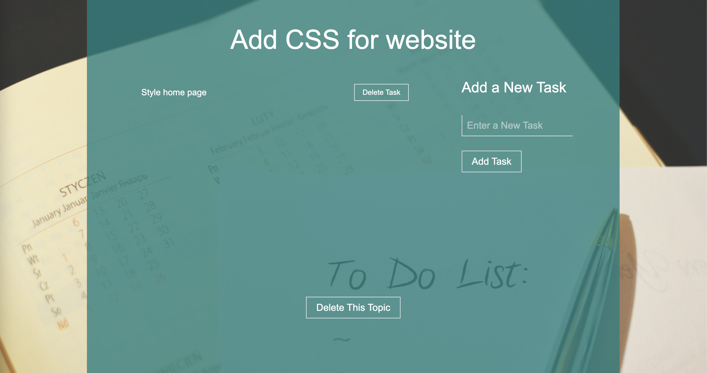

<h1 align="center">THE BLOG POSTER</h1>

## Description
The application allows you to create new topics, you can attach any number of tasks for each topic. You can also delete tasks or delete the entire topic with tasks attached to it.

<p align="center">




</p>

### About the project.
The project is completely done with FLASK. For the front-end part HTML and CSS were used. PostgreSQL was used as a database.

## Project setup

Inside Terminal:

```
On Mac
python3 app.py run

Windows
python app.py run
```